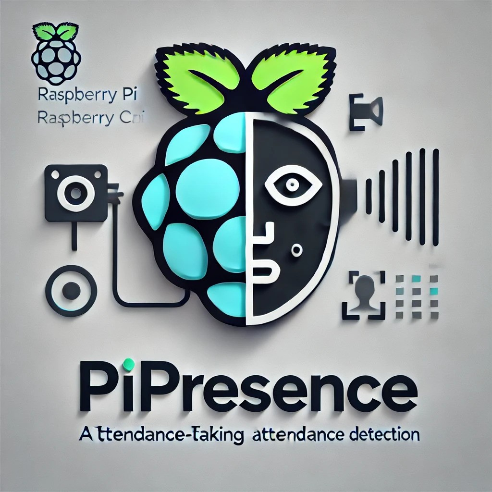

<h1 align="center">

</h1>

## Table of Contents
- [Table of Contents](#table-of-contents)
- [Revolutionizing Attendance with Edge Computing and Deep Learning](#revolutionizing-attendance-with-edge-computing-and-deep-learning)
- [Features](#features)
- [Hardware Requirements](#hardware-requirements)
- [Software Dependencies](#software-dependencies)
- [Installation](#installation)
- [Usage](#usage)
  - [1. Encode Face Database](#1-encode-face-database)
  - [2. Real-time Recognition](#2-real-time-recognition)
  - [3. Batch Processing](#3-batch-processing)
- [Project Structure](#project-structure)
- [Configuration](#configuration)
- [Contributing](#contributing)
- [License](#license)
- [Acknowledgments](#acknowledgments)
- [Presentation](#presentation)

## Revolutionizing Attendance with Edge Computing and Deep Learning

Welcome to **PiPresence**—an automated attendance tracking solution powered by YOLOv8 and MobileFaceNet, designed to run efficiently on edge devices like the Raspberry Pi 4B. By leveraging state-of-the-art deep learning models and edge computing, PiPresence delivers accurate, real-time face detection and recognition without requiring external servers.

## Features

- **Advanced Face Detection**: Uses YOLOv8n for efficient and accurate face detection
- **Robust Face Recognition**: Implements MobileFaceNet for reliable face recognition
- **Multiple Profile Support**: Handles left, front, and right face profiles for better accuracy
- **Edge Processing**: All computations performed locally on the Raspberry Pi
- **Real-time Processing**: Supports both real-time camera feed and batch image processing
- **Flexible Integration**: Choice of weighted average, clustering, or distance-based methods for face embedding
- **Comprehensive Logging**: Detailed logging system with configurable verbosity

## Hardware Requirements

- Raspberry Pi 4B
- Raspberry Pi Camera Module
- MicroSD Card (16GB or larger recommended)
- Power Supply for Raspberry Pi
- Optional: Monitor, Keyboard, and Mouse for setup

## Software Dependencies

- Python 3.9 or higher
- Poetry for dependency management
- Key libraries (automatically managed by Poetry):
  - OpenCV Python
  - ONNX Runtime
  - NumPy
  - FAISS-CPU
  - Click
  - Protobuf

## Installation

1. **Clone the Repository**
```bash
git clone <repository_url>
cd pipresence
```

2. **Install Poetry** (if not already installed)
```bash
curl -sSL https://install.python-poetry.org | python3 -
```

3. **Install Dependencies**
```bash
poetry install
```

4. **Set Up Environment**
```bash
# Activate the virtual environment
poetry shell
```

## Usage

PiPresence offers several operation modes:

### 1. Encode Face Database
Process and encode faces from input images:
```bash
pipresence --encode --input-dir /path/to/raw/images --output-dir /path/to/processed/faces
```

### 2. Real-time Recognition
Run real-time face recognition using camera feed:
```bash
pipresence --infer --camera --verbose
```

### 3. Batch Processing
Process a directory of images:
```bash
pipresence --infer --input-dir /path/to/images --output-dir /path/to/output
```

## Project Structure

```
pipresence/
├── data/
│   ├── models/              # Pre-trained models
│   │   ├── yolov8n-face.onnx
│   │   └── mobilefacenet_fixed.onnx
│   ├── encodings/           # Face embeddings database
│   └── images/             # Input images
├── pipresence/
│   ├── detect_faces.py     # Face detection using YOLOv8
│   ├── recognize_faces.py  # Face recognition using MobileFaceNet
│   ├── preprocess.py      # Image preprocessing
│   ├── config.py          # Configuration settings
│   ├── main.py           # Main application logic
│   └── tools/
│       └── utils.py      # Utility functions
└── pyproject.toml        # Project dependencies and metadata
```

## Configuration

Key parameters can be modified in `config.py`:
- Detection and recognition thresholds
- Image preprocessing settings
- Model paths
- Directory paths
- Logging verbosity

## Contributing

1. Fork the repository
2. Create a feature branch
3. Make your changes
4. Run tests (if available)
5. Submit a pull request

## License

This project is licensed under the MIT License. See the `LICENSE` file for details.

## Acknowledgments

- YOLOv8 for efficient face detection
- MobileFaceNet for accurate face recognition
- ONNX Runtime for optimized model inference
- FAISS for efficient similarity search

## Presentation

The presentation for PiPresence is available in the `Assets` folder under `/doc`. You can view it via the following link:

[View PiPresence Presentation](./doc/Assets/PRESENTATION.md)

---

For issues, feature requests, or contributions, please open an issue or pull request on the repository.