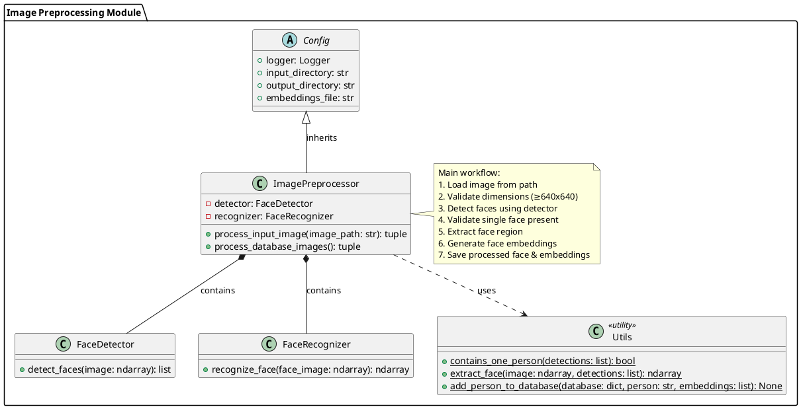

# Image Preprocessing Module Structure

## PlantUML Class Diagram



## PlantUML Syntax Explanation

### Class Definitions
```plantuml
class ClassName {
    + public_attribute
    - private_attribute
    + public_method()
    - private_method()
}
```
- `+` indicates public visibility
- `-` indicates private visibility
- Methods include parentheses to distinguish from attributes

### Relationships
1. **Inheritance** (`<|--`):
   ```plantuml
   Config <|-- ImagePreprocessor
   ```
   - The empty triangle points to the parent class
   - The line connects to the child class
   - Represents "is-a" relationship

2. **Composition** (`*--`):
   ```plantuml
   ImagePreprocessor *-- FaceDetector
   ```
   - The filled diamond is on the containing class
   - Represents "has-a" relationship with lifecycle dependency

3. **Dependency** (`..>`):
   ```plantuml
   ImagePreprocessor ..> Utils
   ```
   - Dotted line with arrow
   - Represents "uses" relationship

### Special Notations
1. **Abstract Classes**:
   ```plantuml
   abstract class Config
   ```
   - Indicates class cannot be instantiated directly

2. **Utility Classes**:
   ```plantuml
   class Utils <<utility>>
   ```
   - Stereotype notation indicates utility/helper class
   - Contains static methods only

3. **Notes**:
   ```plantuml
   note right of ClassName
     Note text here
   end note
   ```
   - Adds explanatory text to diagram
   - Can be positioned left/right/top/bottom of elements

### Package Organization
```plantuml
package "Package Name" {
    // Classes and relationships
}
```
- Groups related classes together
- Improves diagram organization and readability

## Key Differences from Mermaid
1. PlantUML uses `@startuml/@enduml` tags
2. Relationship syntax is different (`<|--` vs `--|>`)
3. More detailed stereotypes and visibility modifiers
4. Package organization capabilities
5. More flexible note placement options

This PlantUML diagram provides a more detailed and technically accurate representation of the Python module structure, including proper typing information and visibility modifiers that weren't shown in the Mermaid version.