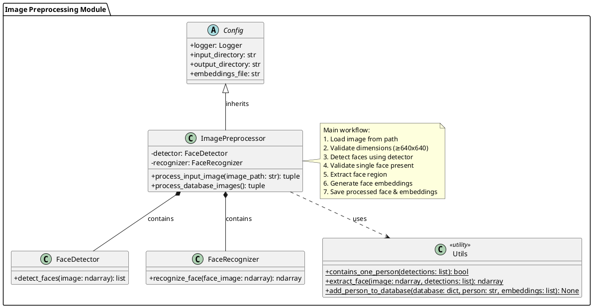
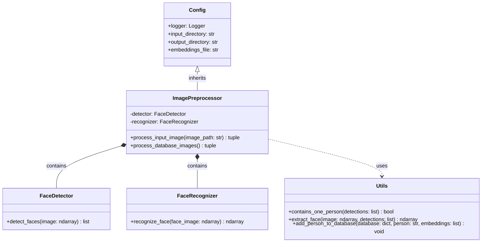

# Image Preprocessing Module Structure

To view this diagram in VSCode, you'll need:
1. Install the "PlantUML" extension by jebbs
2. Install Graphviz (required for PlantUML)
   - Windows: Download from [Graphviz website](https://graphviz.org/download/)
   - Mac: `brew install graphviz`
   - Linux: `sudo apt install graphviz`
3. Install "Markdown Preview Enhanced" extension

## Class Diagram



## Alternative Approach Using Mermaid
If you can't get PlantUML working, you can use Mermaid which is supported natively by GitHub and many Markdown editors:



## Installation Troubleshooting

If you're still having trouble rendering the PlantUML diagram:

1. Verify PlantUML extension settings:
   ```json
   {
     "plantuml.render": "PlantUMLServer",
     "plantuml.server": "https://www.plantuml.com/plantuml",
   }
   ```

2. Try using the online PlantUML editor:
   - Copy the diagram code between `@startuml` and `@enduml`
   - Paste it at [PlantUML Web Server](https://www.plantuml.com/plantuml/uml/)

3. Check if Java is installed (required by some PlantUML extensions):
   ```bash
   java --version
   ```

4. For local rendering, ensure your PATH includes Graphviz:
   - Windows: Add Graphviz's `bin` directory to PATH
   - Unix: `echo $PATH | grep "graphviz"`